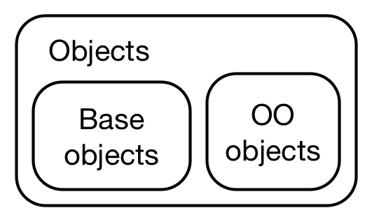

##  类的定义

1.提升自己开发package的能力。
2.提升理解别人package的能力。

“Everything that exists in R is an object”. However, while everything *is* an object, not everything is object-oriented



### Base versus OO objects

```R
#用函数is.object() 或 sloop::otype() 判断：
> is.object(1:10)
[1] FALSE
> sloop::otype(1:10)
[1] "base"

#OO object都有一个”class“属性：
> attr(1:10, "class")
NULL
> attr(obj, "class")
[1] "Seurat"
attr(,"package")
[1] "SeuratObject"
> attr(mtcars, "class")
[1] "data.frame"

# OO objects 有”class“ 属性, 每个object都有一个基础类型:
> typeof(1:10)
[1] "integer"
> typeof(obj)
[1] "S4"
> typeof(mtcars)
[1] "list"
```


### S3

An S3 object is a base type with at least a `class` attribute ，也可以有其他属性用来存储其他数据

S3类内部是一个list，append某个list类名称，就能成为该类。list里面的内容就是属性

 S3对象广泛用于CRAN包的构建中 

```R
#定义S3类型的方法：

#一步创建并赋予类型
> x <- structure(list(), class = "my_class")

#先创建列表对象，再赋予类型
> x <- list()
> class(x) <- "my_class"

#S3对象通常建立在list, vector和function的基础之上，可以通过class()函数来确定对象是属于哪一类，可以通过inherits(x, "classname")来查看对象是否继承来其它的类内容。

#由于S3对象不会检查数据类型，所以在创建S3类的时候最好能够对数据类型就行核实：
f <- function(x){
  if(!is.numeric(x)) stop("X must be numeric")
     structure(list(x), class = "foo")
}
#S3可以随意修改类
class(x) <- "data.frame" 其中的数据结果没有改变
```

在 S3 系统中，可以创建**泛型函数（generic function**），对于不同的类，由泛型函数决定调用哪个方法，这就是**S3 方法分派（method dispatch）**的工作机理。对象的类不同，其方法分派也不同。


### 泛函

```R
x <- 1:10
y <- 1:10 + rnorm(10)
plot(x,y)

fit <- lm(y~x)
plot(fit, 1)

两次调用plot函数，使用的参数完全不一样，没有指定参数名称是什么
一般如果没有指定参数名称，则会将传入数据默认按照参数顺序赋值，而每个参数可以接的变量类型是固定的
#省略2张图

#通过methods()函数来查看一个泛型函数所有的方法
> methods(plot)
  [1] plot,ANY,ANY-method                        plot,color,ANY-method                     
  [3] plot,gpc.poly,ANY-method                   plot,performance,missing-method           
  [5] plot,Spatial,missing-method                plot,SpatialCollections,missing-method    
  [7] plot,SpatialGrid,missing-method            plot,SpatialGridDataFrame,missing-method  
  [9] plot,SpatialLines,missing-method           plot,SpatialMultiPoints,missing-method    
 [11] plot,SpatialPixels,missing-method          plot,SpatialPixelsDataFrame,missing-method
 [13] plot,SpatialPoints,missing-method          plot,SpatialPolygons,missing-method       
 [15] plot,SpatialRings,missing-method           plot.aareg*                        


# 定义泛函，通过UseMethod()来创建一个泛型函数，它通常又两个参数，第一个是该泛型函数名，第二个是泛型函数的方法，第二个参数可以缺省
move <- function(x, ...) UseMethod('move') # 后面的字符串必须与前面函数名相同
# 定义各种方法
move.default <- function(x) print(paste('I am running', x, sep = " "))
move.dog <- function(x) print(paste('I am running', x, sep = " "))
move.fish <- function(x) print(paste('I am swimming', x, sep = " "))

# 创建一个对象d,对象属于dog类，泛型函数的方法派送给类dog
> d <- structure(list(x="miaomiao"), class = "dog")
> move(d)
[1] "I am running miaomiao"

# 泛型函数没有找的合适的方法派送给类bird，因为将default方法派送给类bird.
> move(structure(list(), class = "bird"))
[1] "I am moving"

```


### S4

`S4` 是标准的 `R` 语言面向对象实现方式，比 `S3` 的定义更加严格，`S4` 对象有专门的函数用于定义类（`setClass`）、泛型函数（`setGeneric`）、方法（`setMethod`）以及实例化对象（`new`），提供了参数检查，多重继承功能。

`S4` 有一个重要的组件 `slot`，它是对象的属性组件，可以使用专门的运算符 `@`来访问。

`Bioconductor` 社区是以 `S4` 对象作为基础框架，只接受 `S4` 定义的 `R` 包。

```R
setClass(Class, representation, prototype, contains=character(),
          validity, access, where, version, sealed, package,
          S3methods = FALSE, slots)
 
Class: 定义类名
slots: 定义属性和属性类型
prototype: 定义属性的默认值
contains=character(): 定义父类，继承关系
validity: 定义属性的类型检查
where: 定义存储空间
sealed: 如果设置TRUE，则同名类不能被再次定义
package: 定义所属的包
```


```R
#定义S4类
Seurat <- setClass(
  Class = 'Seurat',
  slots = c(
    assays = 'list',
    meta.data = 'data.frame',
    active.assay = 'character',
    active.ident = 'factor',
    graphs = 'list',
    neighbors = 'list',
    reductions = 'list',
    images = 'list',
    project.name = 'character',
    misc = 'list',
    version = 'package_version',
    commands = 'list',
    tools = 'list'
  )
)

#定义一个S4类必须的参数是 Class="" 和 slots=c()，前者是类名，后者是类的成员变量们，定义形式是 参数名="数据类型"。
```

```
#S4 object 查看
> slot(obj, "active.assay")
[1] "integrated"
> is(obj)
[1] "Seurat"

> slotNames(obj)
 [1] "assays"       "meta.data"    "active.assay" "active.ident" "graphs"       "neighbors"   
 [7] "reductions"   "images"       "project.name" "misc"         "version"      "commands"    
[13] "tools"

> obj@reductions
$pca
A dimensional reduction object with key PC_ 
 Number of dimensions: 50 
 Projected dimensional reduction calculated:  FALSE 
 Jackstraw run: FALSE 
 Computed using assay: integrated 

$umap
A dimensional reduction object with key UMAP_ 
 Number of dimensions: 2 
 Projected dimensional reduction calculated:  FALSE 
 Jackstraw run: FALSE 
 Computed using assay: integrated 
```


## S4类实例化

```R
CreateSeuratObject <- function(
  counts,
  project = 'CreateSeuratObject',
  assay = 'RNA',
  names.field = 1,
  names.delim = '_',
  meta.data = NULL,
  ...
) {
  UseMethod(generic = 'CreateSeuratObject', object = counts)
}


CreateSeuratObject.default <- function(
  counts,
  project = 'SeuratProject',
  assay = 'RNA',
  names.field = 1,
  names.delim = '_',
  meta.data = NULL,
  min.cells = 0,
  min.features = 0,
  row.names = NULL,
  ...
) {
  if (!is.null(x = meta.data)) {
    if (!all(rownames(x = meta.data) %in% colnames(x = counts))) {
      warning("Some cells in meta.data not present in provided counts matrix")
    }
  }
  #细胞和基因过滤，CreateAssayObject函数定义在其他类中
    assay.data <- CreateAssayObject(
    counts = counts,
    min.cells = min.cells,
    min.features = min.features,
    row.names = row.names
  )
  #提供meta.data判断
  if (!is.null(x = meta.data)) {
    common.cells <- intersect(
      x = rownames(x = meta.data), y = colnames(x = assay.data)
    )
    meta.data <- meta.data[common.cells, , drop = FALSE]
  }
  Key(object = assay.data) <- suppressWarnings(expr = UpdateKey(key = tolower(
    x = assay
  )))
  #返回对象
  return(CreateSeuratObject(
    counts = assay.data,
    project = project,
    assay = assay,
    names.field = names.field,
    names.delim = names.delim,
    meta.data = meta.data,
    ...
  ))
}
```


```R
CreateAssayObject <- function(
  counts,
  data,
  min.cells = 0,
  min.features = 0,
  check.matrix = FALSE,
  ...
) {#输入数据检查
  if (missing(x = counts) && missing(x = data)) {
    stop("Must provide either 'counts' or 'data'")
  } else if (!missing(x = counts) && !missing(x = data)) {
    stop("Either 'counts' or 'data' must be missing; both cannot be provided")
  } else if (!missing(x = counts)) { ##main1
    # check that dimnames of input counts are unique
    if (anyDuplicated(x = rownames(x = counts))) {
      warning(
        "Non-unique features (rownames) present in the input matrix, making unique",
        call. = FALSE,
        immediate. = TRUE
      )
      rownames(x = counts) <- make.unique(names = rownames(x = counts))
    }
    if (anyDuplicated(x = colnames(x = counts))) {
      warning(
        "Non-unique cell names (colnames) present in the input matrix, making unique",
        call. = FALSE,
        immediate. = TRUE
      )
      colnames(x = counts) <- make.unique(names = colnames(x = counts))
    }
    if (is.null(x = colnames(x = counts))) {
      stop("No cell names (colnames) names present in the input matrix")
    }
    if (any(rownames(x = counts) == '')) {
      stop("Feature names of counts matrix cannot be empty", call. = FALSE)
    }
    if (nrow(x = counts) > 0 && is.null(x = rownames(x = counts))) {
      stop("No feature names (rownames) names present in the input matrix")
    }
    if (!inherits(x = counts, what = 'dgCMatrix')) {
      if (inherits(x = counts, what = "data.frame")) {
        counts <- as.sparse(x = counts, ...)
      } else {
        counts <- as.sparse(x = counts)
      }
    }
    if (isTRUE(x = check.matrix)) {
      CheckMatrix(object = counts)
    }
    # 基于最小features过滤
    if (min.features > 0) {
      nfeatures <- Matrix::colSums(x = counts > 0)
      counts <- counts[, which(x = nfeatures >= min.features)]
    }
    # 基于基因最少表达的细胞数量过滤
    if (min.cells > 0) {
      num.cells <- Matrix::rowSums(x = counts > 0)
      counts <- counts[which(x = num.cells >= min.cells), ]
    }
    data <- counts
  } else if (!missing(x = data)) {#main2
    # check that dimnames of input data are unique
    if (anyDuplicated(x = rownames(x = data))) {
      warning(
        "Non-unique features (rownames) present in the input matrix, making unique",
        call. = FALSE,
        immediate. = TRUE
      )
      rownames(x = data) <- make.unique(names = rownames(x = data))
    }
    if (anyDuplicated(x = colnames(x = data))) {
      warning(
        "Non-unique cell names (colnames) present in the input matrix, making unique",
        call. = FALSE,
        immediate. = TRUE
      )
      colnames(x = data) <- make.unique(names = colnames(x = data))
    }
    if (is.null(x = colnames(x = data))) {
      stop("No cell names (colnames) names present in the input matrix")
    }
    if (any(rownames(x = data) == '')) {
      stop("Feature names of data matrix cannot be empty", call. = FALSE)
    }
    if (nrow(x = data) > 0 && is.null(x = rownames(x = data))) {
      stop("No feature names (rownames) names present in the input matrix")
    }
    if (min.cells != 0 | min.features != 0) {
      warning(
        "No filtering performed if passing to data rather than counts",
        call. = FALSE,
        immediate. = TRUE
      )
    }
    counts <- new(Class = 'matrix')
  }
  #行名，列名处理
  # Ensure row- and column-names are vectors, not arrays
  if (!is.vector(x = rownames(x = counts))) {
    rownames(x = counts) <- as.vector(x = rownames(x = counts))
  }
  if (!is.vector(x = colnames(x = counts))) {
    colnames(x = counts) <- as.vector(x = colnames(x = counts))
  }
  if (!is.vector(x = rownames(x = data))) {
    rownames(x = data) <- as.vector(x = rownames(x = data))
  }
  if (!is.vector(x = colnames(x = data))) {
    colnames(x = data) <- as.vector(x = colnames(x = data))
  }
  if (any(grepl(pattern = '_', x = rownames(x = counts))) || any(grepl(pattern = '_', x = rownames(x = data)))) {
    warning(
      "Feature names cannot have underscores ('_'), replacing with dashes ('-')",
      call. = FALSE,
      immediate. = TRUE
    )
    rownames(x = counts) <- gsub(
      pattern = '_',
      replacement = '-',
      x = rownames(x = counts)
    )
    rownames(x = data) <- gsub(
      pattern = '_',
      replacement = '-',
      x = rownames(x = data)
    )
  }
  if (any(grepl(pattern = '|', x = rownames(x = counts), fixed = TRUE)) || any(grepl(pattern = '|', x = rownames(x = data), fixed = TRUE))) {
    warning(
      "Feature names cannot have pipe characters ('|'), replacing with dashes ('-')",
      call. = FALSE,
      immediate. = TRUE
    )
    rownames(x = counts) <- gsub(
      pattern = '|',
      replacement = '-',
      x = rownames(x = counts),
      fixed = TRUE
    )
    rownames(x = data) <- gsub(
      pattern = '|',
      replacement = '-',
      x = rownames(x = data),
      fixed = TRUE
    )
  }
  # Initialize meta.features
  init.meta.features <- data.frame(row.names = rownames(x = data))
  assay <- new(
    Class = 'Assay',
    counts = counts,
    data = data,
    scale.data = new(Class = 'matrix'),
    meta.features = init.meta.features,
    misc = list()
  )
  return(assay)
}
```


### 总结一下S4

S4的泛型函数

S4的泛型函数实现有别于S3的实现，S4分离了方法的定义和实现，如在其他语言中我们常说的接口和实现分离。通过setGeneric()来定义接口，通过setMethod()来定义现实类。这样可以让S4对象系统，更符合面向对象的特征。

通过S4对象系统，把原来的函数定义和调用2步，为成了4步进行：

（1）定义数据对象类型

（2）定义接口函数

（3）定义实现函数

（4）把数据对象以参数传入到接口函数，执行实现函数

通过S4对象系统，是一个结构化的，完整的面向对象实现。

```R
#定义Person对象
setClass("Person",slots=list(name="character",age="numeric"))
#定义泛型函数work，即接口
setGeneric("work",function(object) standardGeneric("work"))
#定义work的现实，并指定参数类型为Person对象
setMethod("work", signature(object = "Person"), function(object) cat(object@name , "is working") )
#创建一个Person对象a
a <- new("Person",name="Conan",age=16)
##把对象a传入work函数
work(a)
Conan is working
```


make.unique

anyDuplicated


[R: what are Slots?](https://stackoverflow.com/questions/4713968/r-what-are-slots)

[The Slots in an Object from a Formal Class](https://stat.ethz.ch/R-manual/R-devel/library/methods/html/slot.html)

[Extract or Replace A Slot](https://stat.ethz.ch/R-manual/R-devel/library/base/html/slotOp.html)